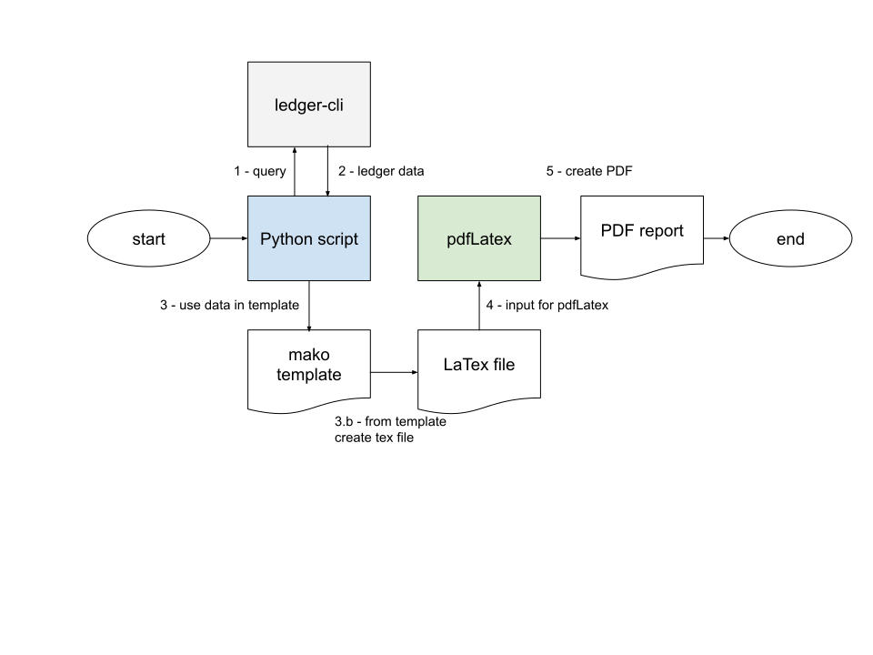

# Reporting ledger-cli result with LaTex

## Other options

Using latex **datatool** package in Tex document with external CSV file and key / value data.  

- [YouTube: Export Python variables and import them into your LaTeX document -- Combining Python with LaTeX](https://www.youtube.com/watch?v=LufMPezEN6Y)
- [https://ctan.org/pkg/datatool](https://ctan.org/pkg/datatool)